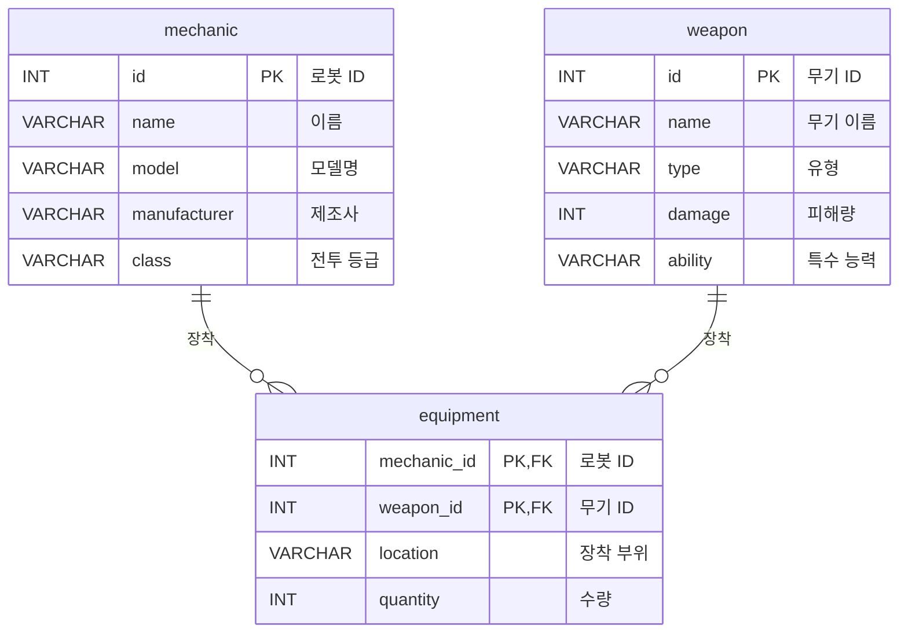

# 데이터베이스 2025

https://nano5.notion.site/Spring-Data-JPA-MySQL-1abdaf211d42817581b9e3dd2ed9d21f?pvs=4

```mermaid
erDiagram
    mechanic ||--o{ equipment : "장착"
    weapon ||--o{ equipment : "장착"

    mechanic {
        INT id PK "로봇 ID"
        VARCHAR name "이름"
        VARCHAR model "모델명"
        VARCHAR manufacturer "제조사"
        VARCHAR class "전투 등급"
    }

    equipment {
        INT mechanic_id PK,FK "로봇 ID"
        INT weapon_id PK,FK "무기 ID"
        VARCHAR location "장착 부위"
        INT quantity "수량"
    }

    weapon {
        INT id PK "무기 ID"
        VARCHAR name "무기 이름"
        VARCHAR type "유형"
        INT damage "피해량"
        VARCHAR ability "특수 능력"
    }
```

